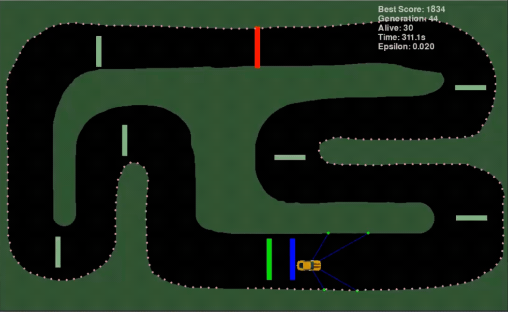
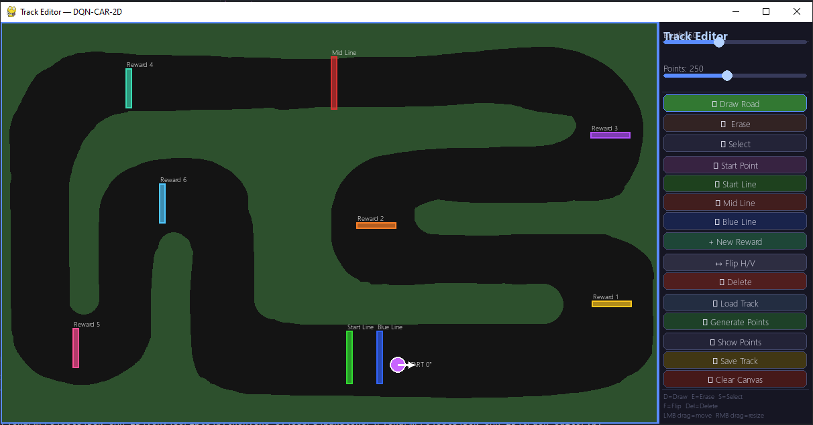

# DQN-CAR-2D: Self-Driving Car Simulation 🏎



DQN-CAR-2D is an advanced 2D simulation platform designed to develop autonomous driving capabilities by combining **Genetic Algorithms (GA)** and **Deep Q-Learning (DQN)** approaches. The project features a comprehensive reward/penalty mechanism and a flexible Track Editor to ensure vehicles navigate complex tracks at peak efficiency and safety.

---

## 📸 Overview

### Track Editor
Design your own tracks, set starting points, and place custom reward lines with ease.


---

## 🌟 Key Features

- **Advanced Genetic Algorithm:** Population-based training featuring Elitism (champion protection) and gene-based Crossover mechanisms.
- **Dynamic Track Editor:** A user-friendly UI to create reward lines, starting points, and track boundaries using drag-and-drop.
- **Smart Masking:** Automatic collision mask generation from any colored track image using **Otsu's Thresholding**.
- **Intelligent Sensor System:** A multi-directional Raycasting system that detects obstacles and measures distances in real-time.
- **Automated Path Tracking:** Automatic derivation of road points to monitor vehicle progress and calculate distance-based fitness accurately.

---

## 🧠 Training Mechanics

The training process focuses on maximizing the vehicle's survival time and its progress along the track.

### 💰 Reward System
To accelerate the learning process, the following bonuses are applied:
- **Distance Bonus:** Points awarded for every unit of progress made along the track.
- **Incremental Reward Lines:** Extra points granted for passing custom lines. The bonus increases based on the line's sequence (**+50, +100, +150...**).
- **Speed Bonus:** Additional points awarded per frame when the vehicle's speed exceeds **10** units.
- **Cornering Bonus:** Rewards for making active, correct turns while maintaining forward momentum.
- **Lap Completion:** High-multiplier rewards for vehicles that successfully finish a full lap.

### ⚠️ Penalty System
To discourage inefficient or dangerous behavior, the following penalties are enforced:
- **Collision Penalty:** Immediate termination of the agent upon hitting a wall.
- **Backward Movement Penalty:** Heavy point deductions and automatic termination if a vehicle moves against the track direction for more than 3 seconds.
- **Sluggishness Penalty:** Small point deductions for vehicles that fall below the target speed.
- **Jitter Penalty:** Stability penalties for rapid, unnecessary steering changes to ensure smooth driving.

---

## 🛠️ Technical Stack

- **Python 3.10+**
- **Pygame:** Simulation engine and visualization.
- **PyTorch:** Neural network implementation and model management.
- **NumPy & OpenCV:** Image processing and thresholding operations.

---

## 🚀 Getting Started

### 1. Installation
```bash
git clone https://github.com/mbahadirk/DQN-CAR-2D.git
cd DQN-CAR-2D
pip install -r requirements.txt
```

### 2. Track Design
To create a new track or edit an existing one:
```bash
python track_editor.py
```

### 3. Start Training
Navigate to the Genetic Algorithm directory and launch the training script:
```bash
cd "Genetic Algorithm"
python train.py
```

---

## 📂 Project Structure

- `Genetic Algorithm/`: GA-based training scripts and model saves.
- `Q-Learning/`: Alternative DQN-based training approaches.
- `utilities/`: Tools for road point generation, masking, and data processing.
- `images/`: Track images and vehicle assets.
- `road_points/`: Track-specific `.txt` (road points) and `.json` (object configurations) files.

---

## 🎮 In-Training Controls
- **S Key:** Saves the current best model as `best_model.pt`.
- **UP/DOWN Arrow Keys:** Manually increase or decrease the Epsilon (exploration rate) value.

---

*This project is a research and development study focused on artificial intelligence and autonomous systems.*
